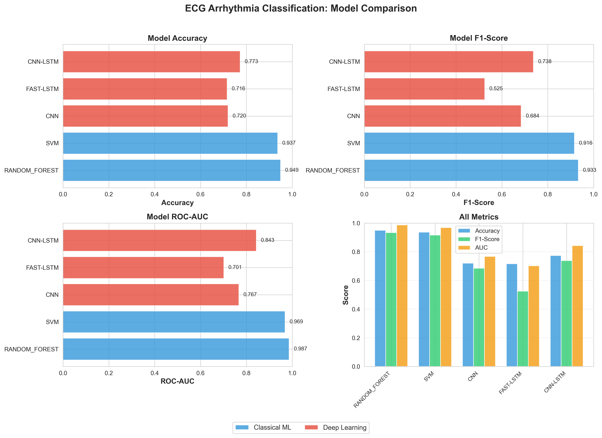

# ECG Arrhythmia Classification - Comprehensive Report

**Generated:** 2025-12-11 07:57:11

## Experimental Setup

- **Dataset:** MIT-BIH Arrhythmia Database
- **Records:** 100, 101, 102, 103, 104, 105, 106, 107, 108, 109, 111, 112, 113, 114, 115, 116, 117, 118, 119, 121, 122, 123, 124, 200, 201, 202, 203, 205, 207, 208, 209, 210, 212, 213, 214, 215, 217, 219, 220, 221, 222, 223, 228, 230, 231, 232, 233, 234
- **SMOTE:** No
- **Epochs:** 40
- **LSTM Type:** Fast (Optimized)

## Results Summary

### Classical Machine Learning

| Model | Accuracy | F1-Score | AUC | Bal. Accuracy |
|-------|----------|----------|-----|---------------|
| RANDOM_FOREST | 0.949 ± 0.002 | 0.933 ± 0.003 | 0.987 ± 0.001 | 0.942 ± 0.003 |
| SVM | 0.937 ± 0.003 | 0.916 ± 0.005 | 0.969 ± 0.003 | 0.927 ± 0.004 |

### Deep Learning

| Model | Accuracy | F1-Score | AUC | Training Time |
|-------|----------|----------|-----|---------------|
| CNN | 0.720 ± 0.073 | 0.684 ± 0.099 | 0.767 ± 0.090 | 276m |
| FAST_LSTM | 0.716 ± 0.080 | 0.525 ± 0.244 | 0.701 ± 0.125 | 222m |
| CNN_LSTM | 0.773 ± 0.089 | 0.738 ± 0.088 | 0.843 ± 0.079 | 2201m |

## Visualizations

## Notes

- Used optimized `fast_lstm` instead of standard LSTM for faster training
- Fast LSTM downsamples input by 4x, reducing training time by 4-8x